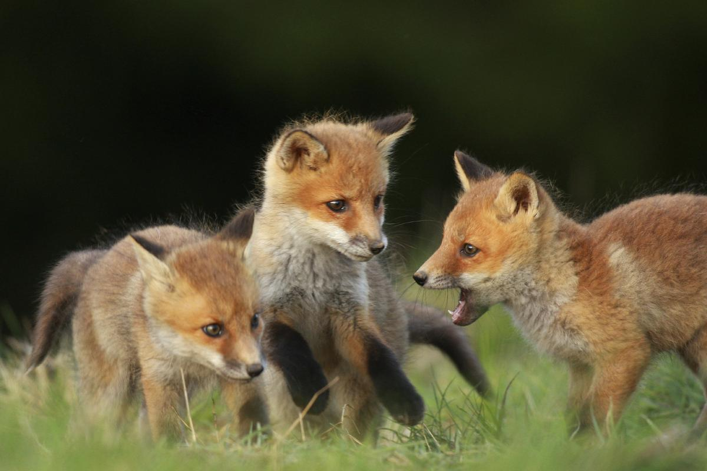
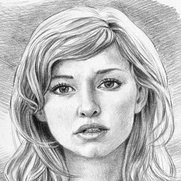
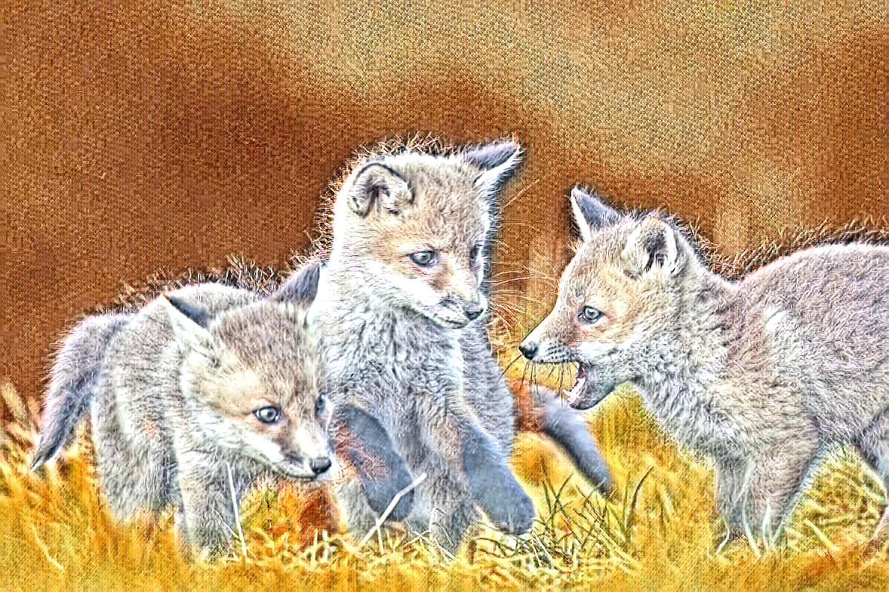
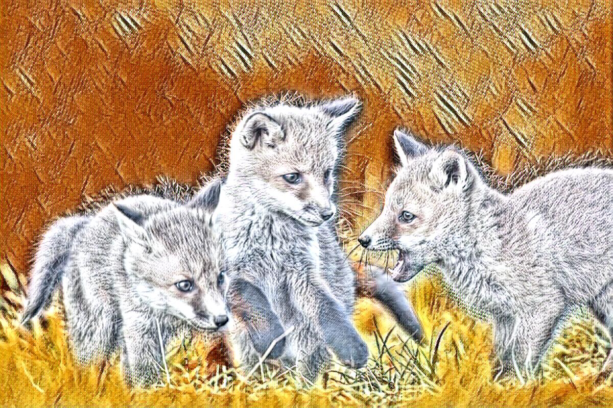
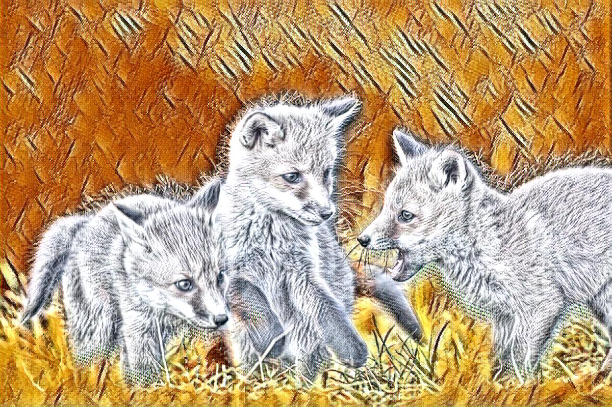
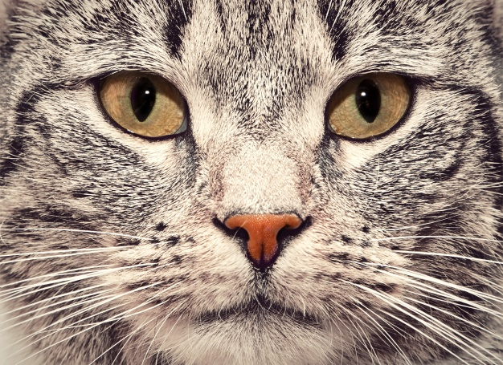
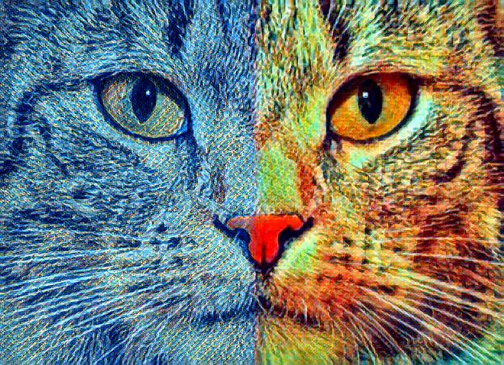
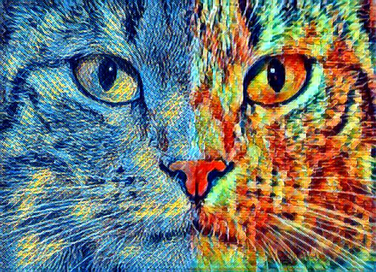
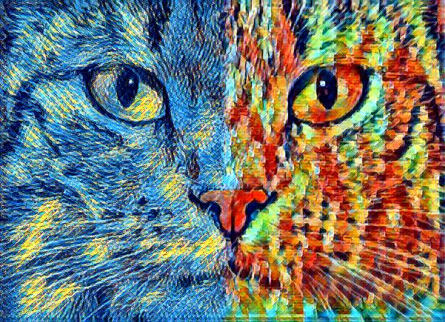

# style-transfer-with-strength-and-spatial-control
This repository contains a pytorch implementation of our [group project](https://github.com/c76068/style-transfer-with-strength-and-spatial-control-/blob/master/Computer_Vision_Final_Report.pdf) for CS 461/661 Computer Vision in spring 2020 at Johns Hopkins University. We combined the style transfer approaches developed in [Controlling Perceptual Factors in Neural Style Transfer](https://ieeexplore.ieee.org/document/8099880) and [Real-Time Style Transfer With Strength Control](https://link.springer.com/chapter/10.1007/978-3-030-29891-3_19) to to build a pipeline for fast style transfer with spatial and strength control. Our implementation allows transfer of two distinct styles onto two regions of the input content image guided by masks generated from [semantic
segmentation](https://arxiv.org/abs/1706.05587). Our code was adapted from [
style-transfer-with-strength-control ](https://github.com/victorkitov/style-transfer-with-strength-control) and the code for computing receptive field was taken from [pytorch-receptive-field](https://github.com/Fangyh09/pytorch-receptive-field).

## Usage
Stylize image:
```
python test_2sty.py --content 'images/contents/foxcat.jpg' --model 'models/pencil_picasso_traincount100000_styweight50000.0_bs10.pth' --style_strength 1 --switch True --mask 1 --gpu_id 0
```
optional arguments:
*  `-h, --help`            show help message and exit
*  `--content CONTENT [CONTENT ...]`
                        sequence of content images to be stylized (default:
                        images/contents/bus.jpg)
*  `--out_dir OUT_DIR`     directory where stylized images will be stored
                        (default: images/results/)
*  `--model MODEL`         path to serialized model, obtained via train.py
                        (default: models/la_muse.pth)
*  `--style_strength STYLE_STRENGTH`
                        non-negative float parameter, controlling stylization
                        strength (default: 1)
*  `--switch`           switch the order of imposed styles (default:False)
*  `--use_parallel_gpu USE_PARALLEL_GPU`
                        model trained using single GPU or using
                        parallelization over multiple GPUs (default: False)
*  `--gpu_id GPU_ID`       GPU to use (defaut: 0)
*  `--scale_content SCALE_CONTENT`
                        scaling factor for content images (default:None, no
                        scaling)
*  `--mask`             set it to 1 for object segmentation mask, 2 for vertical mask, 3 for horizontal mask (default: 1)

Train model:
```bash
python style-transfer-with-strength-control-master/train_2sty.py --style_image1 'style-transfer-with-strength-control-master/images/styles/pencil.jpg' --style_image2 'style-transfer-with-strength-control-master/images/styles/picasso.jpg' --dataset 'data' --batch_size 10 --max_train_count 100000 --style_weight 5e4 --save_model_dir 'style-transfer-with-strength-control-master/models/' --log_batches_interval 20 --gpu_id 0
```
optional arguments:
*  `-h, --help`           show help message and exit
*  `--max_train_count MAX_TRAIN_COUNT`
                        training will stop after passing this number of images
                        (default: 160000)
*  `--log_batches_interval LOG_BATCHES_INTERVAL`
                        number of batches after which the training loss is
                        logged (default: 80)
*  `--style_image1 STYLE_IMAGE1`
                        path to style-image (default:
                        images/styles/la_muse.jpg)
*  `--style_image2 STYLE_IMAGE2`
                        path to style-image (default:
                        images/styles/feathers.jpg)
*  `--binary_image`     path to binary-image used as mask in the training (default= None, automatically specified a vertical mask)                       
*  `--gpu_id GPU_ID`       GPU to use (default: 0)
*  `--style_weight STYLE_WEIGHT`
                        weighting factor for style loss (default: 100000)
*  `--tv_weight TV_WEIGHT`
                        weighting factor for total variation loss (default:
                        1e-05)
*  `--max_style_strength MAX_STYLE_STRENGTH`
                        during training style_strength will be sampled
                        randomly from
                        [0,style_strength_step,...max_style_strength]
                        (default: 10)
*  `--style_strength_step STYLE_STRENGTH_STEP`
                        during training style_strength will be sampled
                        randomly from
                        [0,style_strength_step,...max_style_strength]
                        (default: 0.1)
*  `--dataset DATASET`     path to content images dataset on which model will be
                        trained, should point to a folder, containing another
                        folder with images (default:
                        ../../Datasets/Contents/MS-COCO/train2014)
*  `--checkpoint_batches_interval CHECKPOINT_BATCHES_INTERVAL`
                        number of batches after which a checkpoint of the
                        trained model will be created (default: None)
*  `--max_style_pixels MAX_STYLE_PIXELS`
                        max size in total pixels count of style-image during
                        training, None for no scaling (default: 160000)
*  `--use_parallel_gpu USE_PARALLEL_GPU`
                        model trained using single GPU or using
                        parallelization over multiple GPUs (default: False)
*  `--image_size IMAGE_SIZE`
                        during training content images are resized to this
                        size along X and Y axis (default: 256)
*  `--batch_size BATCH_SIZE`
                        size of batches during training (default: 12)
*  `--lr LR`               learning rate (default: 0.001)
*  `--init_model INIT_MODEL`
                        path to model if need model finetuning (default: )
*  `--save_model_dir SAVE_MODEL_DIR`
                        path where model will be saved (default: models/)
*  `--checkpoint_model_dir CHECKPOINT_MODEL_DIR`
                        path to folder where checkpoints of trained models
                        will be saved (default: intermediate_models/)
*  `--seed SEED`           random seed (default: 1)
*  `--loss_averaging_window LOSS_AVERAGING_WINDOW`
                        window averaging for losses (this average is displayed
                        during training) (default: 500)

## Trained models and examples:
Our trained models were saved in the folder [models](https://github.com/c76068/style-transfer-with-strength-and-spatial-control-/tree/master/models). For detailed hyperparameters and training data we used, please see our [final report](https://github.com/c76068/style-transfer-with-strength-and-spatial-control-/blob/master/Computer_Vision_Final_Report.pdf).

<table align='center'>
<tr align='center'>
<td> 
<td> 
<td> 
</tr>
<tr>
<td> Content</td>
<td> Style 1</td>
<td> Style 2</td>
</tr>
<tr>
<td> 
<td> 
<td> 
</tr>
</table>

<div align='center'>
  
  
  
  <br>
  
  
  
</div>

